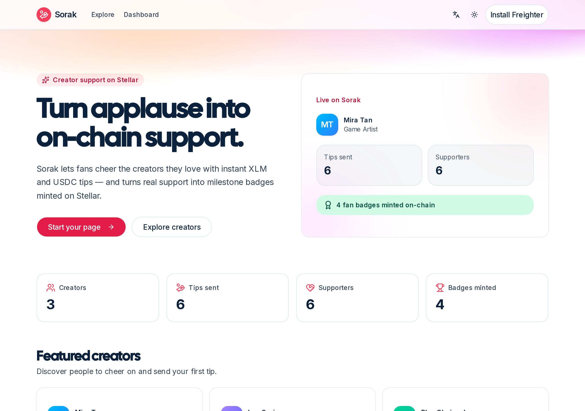
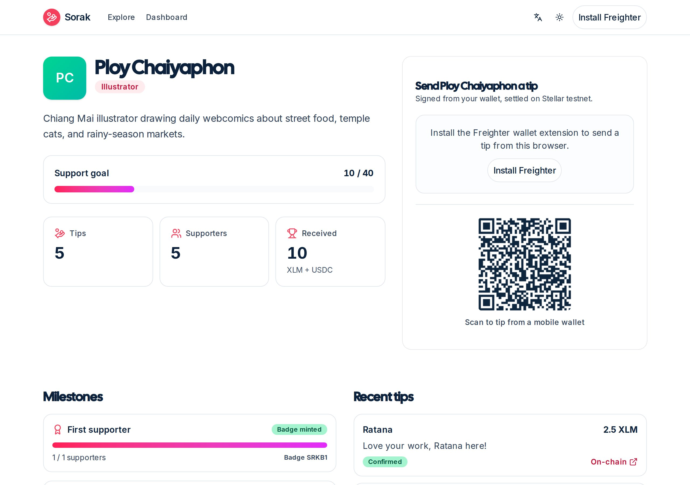
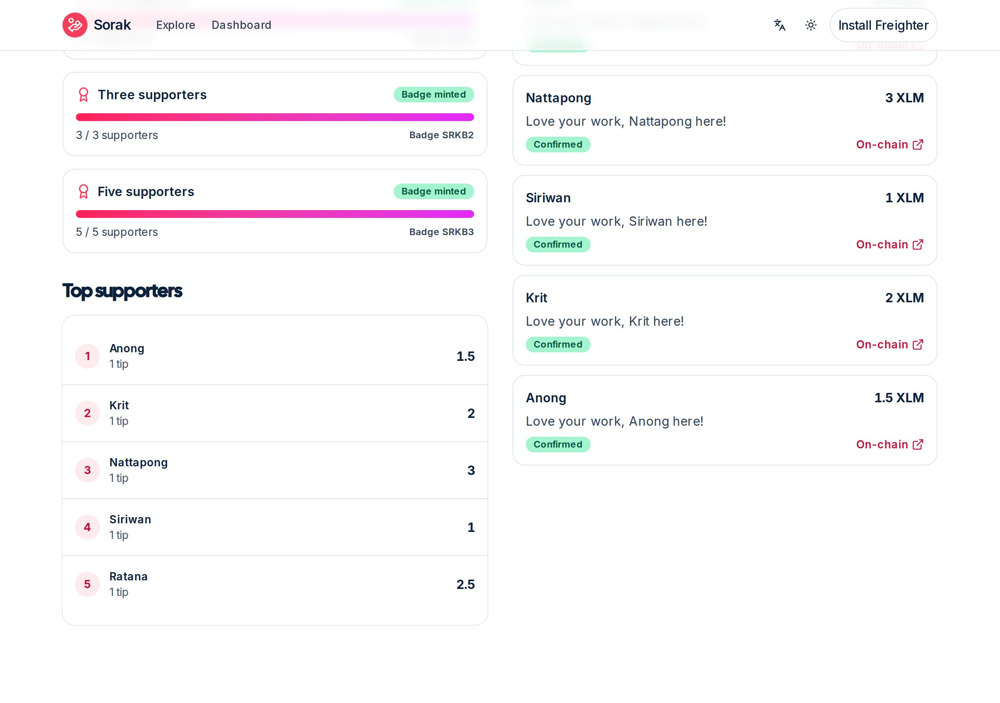
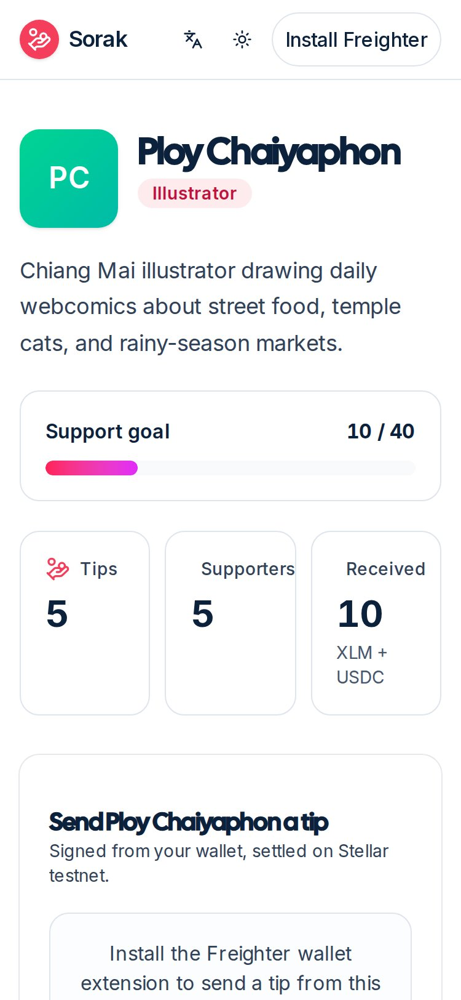

<div align="center">

## 🌐 Mainnet (LIVE)

- **Live app:** https://sorak-stellar.vercel.app
- **Network:** Stellar public (mainnet)
- **Soroban contract:** `CBPUFYPU73X3L6KYZEOPASWBSFAS5QQJMQL3P3TL3CEUAKHM6ABLFFXR`
- **Explorer:** https://stellar.expert/explorer/public/contract/CBPUFYPU73X3L6KYZEOPASWBSFAS5QQJMQL3P3TL3CEUAKHM6ABLFFXR


# 🫶 Sorak — turn applause into on-chain support

**A creator tip page on Stellar: fans cheer in USDC or XLM with one QR scan, and hitting a supporter milestone mints a fan-badge asset on-chain — instantly.**


**Live demo → https://sorak-amber.vercel.app**

<br/>



<br/><br/>




<br/><br/>



<sub>Landing with real platform stats · a creator page (tip panel + QR) · the live supporter feed and milestone badges · mobile.</sub>

</div>

---

## What is Sorak?

Independent creators across Southeast Asia — illustrators in Chiang Mai, lo-fi producers in Bangkok, indie game artists in Manila — earn from a global audience but collect through platforms that take 10–30%, hold payouts for weeks, and make a $1 cross-border tip uneconomical on card rails. So the tip that would have said "I see you, keep going" never gets sent.

Sorak makes that tip trivial. A fan opens a creator's page, taps an amount, and signs **one** Stellar transaction — it settles in about five seconds for a fraction of a cent. If the creator has never opened a wallet, the tip is sent as a **claimable balance** instead of a bounced payment, so support is never lost to `op_no_trust`. And when a creator crosses a supporter milestone, the platform issuer **mints a fan-badge asset and sends it on-chain** to the fan who crossed it — turning the moment of support into a verifiable collectible.

## 🔁 How it works

1. **Connect** — the creator signs in with Freighter via a SEP-10 challenge (pinned to testnet).
2. **Share** — every creator page exposes a SEP-7 payment URI + QR anyone can scan to tip.
3. **Tip** — a fan enters XLM or USDC; the server builds an unsigned XDR (a direct payment for a funded creator, a claimable balance for an unfunded one), the fan signs and submits, and the hash is verified on Horizon.
4. **Celebrate** — crossing a supporter milestone mints a fan-badge asset on-chain; the live Horizon feed lights up the leaderboard within seconds.
5. **Claim** — creators claim any claimable-balance tips from the dashboard; a USDC claim prepends a `changeTrust` so they're never stranded.

## ✨ Highlights

- 🤝 **Tips that never bounce** — unfunded creators receive a Stellar claimable balance, not a failed payment.
- 🏅 **Fan badges minted on-chain** — a milestone mints an issued asset and delivers it in a single issuer-signed transaction. This is the wow moment, and it's real on testnet.
- 📷 **One-scan tipping** — SEP-7 URI + QR works with any Stellar wallet.
- 🪙 **XLM by default, USDC one tap away** — a platform-sponsored trustline (CAP-33) lets a creator receive USDC with zero XLM.
- 📡 **Live, not polled** — Horizon SSE streams every tip and badge mint straight into the feed.
- 🔐 **Non-custodial** — the fan signs every payment in their own wallet; Sorak never holds keys or funds.
- ⚡ **~5s settlement, sub-cent fees** — the difference between a $1 cross-border tip being possible and impossible.

## ⛓️ On-chain mechanics

A fan's XLM tip to a funded creator now settles through a Soroban contract, **`SorakMilestone`**, instead of a plain payment: `record_tip` moves the tip supporter → contract → creator in one call and returns the lifetime-total tier the fan just crossed. The milestone service reads that tier straight off-chain to decide whether to mint a fan badge — no separate off-chain counter to trust. Unfunded creators and USDC tips still use claimable balances, since the contract binds a single XLM SAC token.

| Primitive | Role in Sorak |
|---|---|
| Soroban contract (`SorakMilestone`) | On-chain cumulative-tip tracking + milestone-tier detection for funded XLM tips |
| SEP-10 | Wallet login via signed challenge, pinned to testnet |
| SEP-7 | Payment URI + QR for one-scan tipping |
| Claimable Balances | Tips to unfunded creators; USDC tips; on-chain fan-badge delivery |
| Issued Assets | Fan-badge collectibles minted by the platform issuer |
| Sponsored Reserves (CAP-33) | USDC trustline onboarding with zero XLM |
| Horizon SSE | Real-time supporter feed and leaderboard |

**Contract (testnet):** [`CCEP2O7CHXACVJA56XOERMVH65BQJKCGIKMPQIDUF5QMQVJL7EEYWJ4B`](https://stellar.expert/explorer/testnet/contract/CCEP2O7CHXACVJA56XOERMVH65BQJKCGIKMPQIDUF5QMQVJL7EEYWJ4B) — `initialize` / `record_tip` / `total_given` / `list_milestones`.

**Platform badge issuer (testnet):** [`GBOLYDTMKTFYA5GK64TLNUP2GXUWWYCDAZUWITBEDQSESYJLWZB4DVRI`](https://stellar.expert/explorer/testnet/account/GBOLYDTMKTFYA5GK64TLNUP2GXUWWYCDAZUWITBEDQSESYJLWZB4DVRI)

The app is network-aware: flip `NEXT_PUBLIC_STELLAR_NETWORK` / `STELLAR_NETWORK` from `testnet` to `public` to run on mainnet.

## FRONTEND → CONTRACT WIRING (where to look)

The `SorakMilestone` contract is invoked from exactly two server files. Both build the `Contract` from `stellar.contractId`, which resolves to the deployed testnet id `CCEP2O7CHXACVJA56XOERMVH65BQJKCGIKMPQIDUF5QMQVJL7EEYWJ4B` (`env.SOROBAN_CONTRACT_ID`). A funded creator's XLM tip is a single Freighter-signed `record_tip` invoke — the server builds the prepared Soroban XDR, the fan signs once, the server submits it and reads back the milestone tier.

**`src/server/stellar/milestone-contract.ts`** — the real invoke. `contract()` wraps the deployed contract id; `contract().call('record_tip', …)` builds the operation; `prepareTransaction` returns the signable XDR:

```ts
function contract(): Contract {
  return new Contract(stellar.contractId); // CCEP2O7…WJ4B on testnet
}

const tx = new TransactionBuilder(account, {
  fee: BASE_FEE,
  networkPassphrase: stellar.passphrase,
})
  .addOperation(contract().call('record_tip', addr(creator), addr(supporter), i128(amountStroops)))
  .setTimeout(180)
  .build();

const prepared = await srv.prepareTransaction(tx);
return prepared.toXDR();
```

The signed XDR is submitted over Soroban RPC, reading the returned milestone tier off-chain:

```ts
export async function submitRecordTipXdr(signedXdr: string): Promise<RecordTipSubmit> {
  const srv = server();
  const tx = TransactionBuilder.fromXDR(signedXdr, stellar.passphrase);
  const sent = await srv.sendTransaction(tx);
  const got = await srv.getTransaction(sent.hash);
  let tier = 0;
  if (got.returnValue) tier = Number(scValToNative(got.returnValue) ?? 0);
  return { hash: sent.hash, tier };
}
```

**`src/server/service/tip.service.ts`** — the call site the two API routes reach. `buildTip` makes the XDR; `recordTip` submits it and feeds the on-chain tier into badge-minting:

```ts
import { buildRecordTipInvoke, submitRecordTipXdr } from '@/server/stellar/milestone-contract';

if (milestoneContractEnabled && input.asset === 'XLM' && refreshed.accountFunded) {
  const xdr = await buildRecordTipInvoke(fanPublicKey, refreshed.ownerPublicKey, displayToStroops(amount));
  return { method: 'direct', xdr, contract: true, /* …destination, network… */ };
}

if (viaContract) {
  const submitted = await submitRecordTipXdr(input.signedXdr as string);
  txHash = submitted.hash;
  onchainTier = submitted.tier; // drives milestoneService.evaluate → fan badge
}
```

Controller → contract entry-point trace: `POST /api/tips/build → tipService.buildTip → buildRecordTipInvoke → SorakMilestone record_tip (build)` · `POST /api/tips/record → tipService.recordTip → submitRecordTipXdr → SorakMilestone record_tip (submit)`.

## 🧱 Tech stack

- **Next.js 16** (App Router, Turbopack) · **React 19** · **TypeScript** strict
- **@stellar/stellar-sdk** + **Freighter** for wallet auth and signing
- **Drizzle ORM** on **Postgres**
- **Tailwind v4** + **shadcn/ui**, **Inter** + **Cal Sans** type
- **next-intl** · **Vitest** + **Playwright** + **axe-core**

## 🚀 Quick start (local dev)

```bash
pnpm install
cp .env.example .env.local
# set SESSION_SECRET (>=32 chars), DRIZZLE_DATABASE_URL, and a funded
# testnet PLATFORM_ISSUER_SECRET in .env.local
pnpm run db:push     # create tables
pnpm run seed        # real testnet tips + on-chain badges
pnpm run dev         # http://localhost:3001
```

## 🗺️ Project structure

```
app/                 Next.js routes — pages + /api handlers
  [locale]/          marketing (landing, /c/[handle]) + app (dashboard, connect)
  api/               creators, tips, stats, onboarding, auth, SSE stream
src/server/
  db/schema/         creators · tips · milestones · badges
  service/           creator · tip (state machine) · milestone · usage
  stellar/           sep7 · claimable · assets · account · tx · milestone-contract (Soroban)
  middleware/        compose · withAuth · withError · withRateLimit
src/ui/              pages, sorak components, hooks (Freighter, tipping, SSE)
messages/            i18n catalog (en)
docs/                design · technical-flow · description · SUBMISSION (plain text)
```

<div align="center">
<sub><b>Sorak</b> — turn applause into on-chain support. Built on Stellar for the APAC Hackathon 2026.</sub>
</div>
